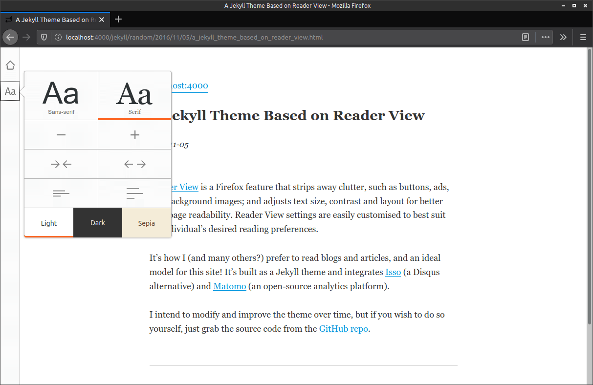

# Reader-View Jekyll Template

*A Jekyll theme based on the Firefox Reader View, for a clean, clear, customisable blog interface*

Check the ``_config.yml`` for configuration options. It includes parameters for
Isso (a Disqus alternative) and Matomo (open-source analytics platform).

* [demonstration](https://tabreturn.github.io/)

## to-do
- [x] mobile view style fixes for comment section
- [x] topics filter to use url (e.g. #physics)
